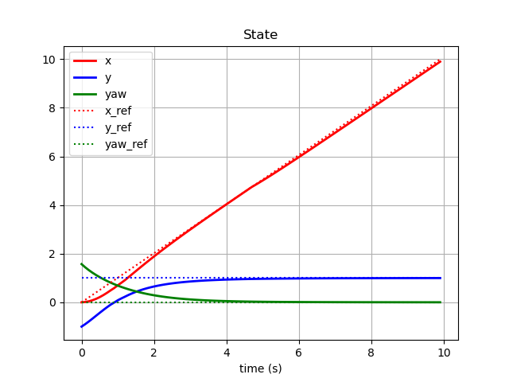
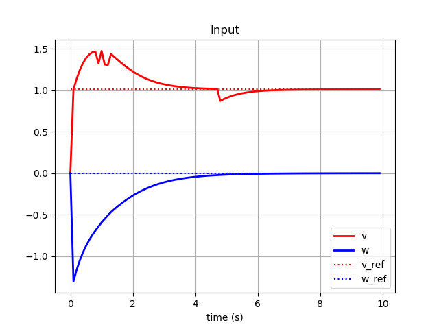
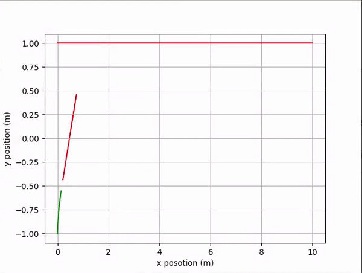
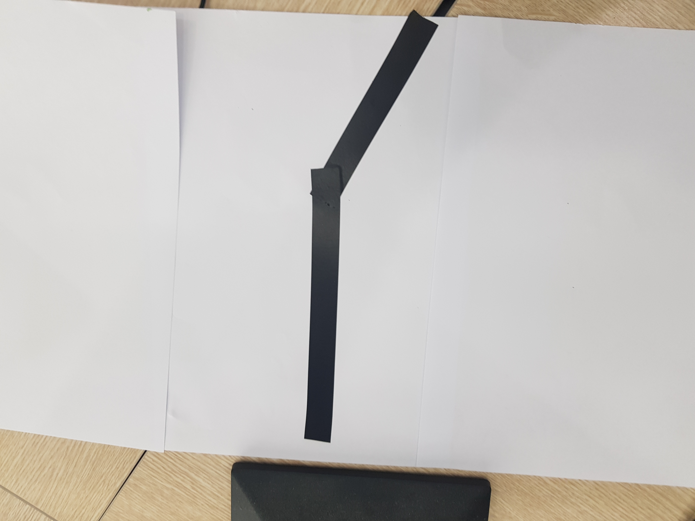
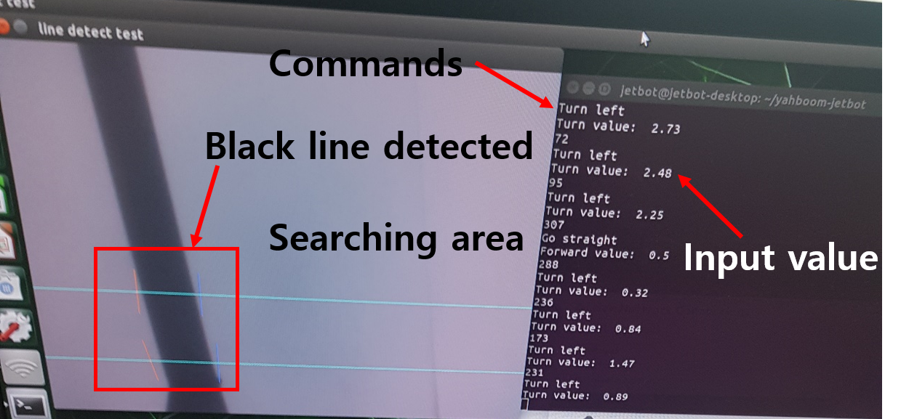

# Hackathon class 6

Introduce mpc, pid control simply by tracking straight line trajectory

## Implemntation of wmr based kinemiatcs

### Dependencies
- python >= 3.6
- numpy
- cvxpy
- math
- matplotlib

To implement code, 
    
    python3 mpc_wmr.py

### Result

#### State graph

#### Input graph

#### Gif

## Reference
1. Kuhne, F., Lages, W. F., & da Silva Jr, J. G. (2004, September). Model predictive control of a mobile robot using linearization. In Proceedings of mechatronics and robotics (pp. 525-530).
2. "Mohamed W. Merze (2020, June 23)." MPC and MHE implementation in MATLAB using Casadi. [Video file]. https://www.youtube.com/playlist?list=PLK8squHT_Uzej3UCUHjtOtm5X7pMFSgAL

## Line tracing simple demo
### Dependencies
- python >= 3.6
- sys
- cv2
- numpy
- os
- time
- jetbot

To implement code,

    python3 lineDetection.py

### Result
#### Used road

#### Vision

#### Implementation

### Issues
1. 몇몇 input을 입력했을 때에 (ex. 0.5보다 작은 input) 로봇 모터에서 소리만 나고 굴러가지 않는 경우가 발생. (Constraint가 필요하다고 생각됨.)
2. 현재 제어기는 단순 P 제어기로 error에 대해서 Kp 정도를 곱해주는 방식으로 작동함. 

## Reference
1. OpenCV & Numpy Line Detection: https://www.youtube.com/watch?v=ANUnJp7P_8A&t=73s